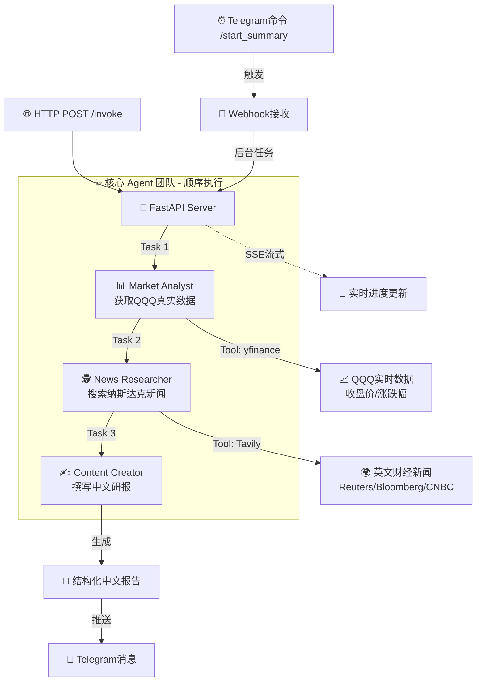

# 🚀 Connect-to-QQQ100-Index-Agent

> **你的私人纳斯达克 100 指数 AI 分析师 | Your Personal NASDAQ-100 AI Analyst (｡•̀ᴗ-)✧**


## 🌟 项目简介 (What is this?)

欢迎来到 **QQQ100-Index-Agent**！这是一个基于 CrewAI 的多智能体协作系统，专注于纳斯达克 100 指数（QQQ）的自动化分析。

你是否厌倦了每天收盘后还要手动翻看 K 线和新闻？(￣ ▽ ￣)"

这个 Agent 团队的目标是解放你的双手：

1. **自动盯盘**：实时捕捉 QQQ（纳指 100 ETF）当天的涨跌幅和收盘价
2. **智能搜寻**：自动搜索全球英文财经新闻，分析市场波动原因（是鲍威尔又讲话了？还是英伟达起飞了？）
3. **专业研报**：由资深财经编辑 Agent 汇总成一份结构化的中文盘后总结
4. **Telegram 推送**：通过 Telegram Bot 实时推送分析结果到你的手机
5. **流式输出**：通过 SSE (Server-Sent Events) 实时查看 AI 的思考过程

---

## 🛠️ 工作流 (How it works?)

我们的 AI 团队由三位顶尖专家（Agents）组成，他们协同工作，为你服务：



### 🤖 认识一下团队成员

| 角色                   | 职责                                       | 工具            | 输出                    |
| :--------------------- | :----------------------------------------- | :-------------- | :---------------------- |
| **📊 Market Analyst**  | 获取 QQQ 的最新收盘价、涨跌额、涨跌幅      | `yfinance`      | JSON 格式的市场数据     |
| **🕵️ News Researcher** | 搜索纳斯达克相关英文新闻，分析市场驱动因素 | `Tavily Search` | Markdown 格式的新闻摘要 |
| **✍️ Content Creator** | 整合数据和新闻，撰写专业的中文盘后总结     | 无（纯写作）    | 结构化中文报告          |

**关键特性**：

- ✅ **任务依赖传递**：Task 3 通过 `context=[Task1, Task2]` 接收前两个任务的输出
- ✅ **Memory 禁用**：避免历史对话污染，每次分析都是全新的
- ✅ **明确指令**：强制使用英文关键词搜索，禁止搜索中国 A 股市场
- ✅ **数据验证**：要求输出必须包含具体数字，禁止模糊描述

---

## 🛠️ 技术栈 (Tech Stack)

本项目使用以下核心库构建：

### 核心框架

- **[CrewAI](https://github.com/joaomdmoura/crewai)**: `^1.7.0` - 多 Agent 协同框架
- **[CrewAI Tools](https://github.com/joaomdmoura/crewai-tools)**: `^1.7.0` - Agent 工具集
- **[FastAPI](https://fastapi.tiangolo.com/)**: `^0.124.4` - 高性能 Web 框架（支持 SSE 流式输出）
- **[Uvicorn](https://www.uvicorn.org/)**: `^0.30.0` - ASGI 服务器

### 数据与搜索

- **[yfinance](https://github.com/ranaroussi/yfinance)**: `^0.2.66` - 雅虎财经数据获取（QQQ 实时行情）
- **[Tavily](https://tavily.com/)**: `^0.7.17` - AI 优化的搜索引擎（专注英文财经新闻）
- **[LangChain Community](https://python.langchain.com/)**: `^0.4.1` - LangChain 社区工具

### 工具与配置

- **[python-dotenv](https://github.com/theskumar/python-dotenv)**: `^1.0.0` - 环境变量管理
- **[uv](https://github.com/astral-sh/uv)**: 超快的 Python 包管理器（替代 pip）
- **[Ruff](https://github.com/astral-sh/ruff)**: `^0.14.9` - 极速 Python 代码检查和格式化

### 平台兼容性

> 💡 **Windows 用户注意**：本项目已内置 Windows 信号兼容性修复（`main.py` 和 `test_context.py`），解决了 CrewAI 在 Windows 上运行时的 `AttributeError: module 'signal' has no attribute 'SIGHUP'` 问题。

---

## ⚡ 快速开始 (Quick Start)

我们要使用最酷的 **uv** 包管理器来运行这个项目！速度飞快！🚀

### 1. 克隆项目

```bash
git clone https://github.com/CaiusLuo/Connect-to-QQQ100-index-agent.git
cd Connect-to-QQQ100-index-agent
```

### 2. 安装 uv（如果还没有）

```bash
# macOS/Linux
curl -LsSf https://astral.sh/uv/install.sh | sh

# Windows (PowerShell)
powershell -c "irm https://astral.sh/uv/install.ps1 | iex"

# 或者使用 pip
pip install uv
```

### 3. 安装依赖

`uv` 会自动创建虚拟环境并安装所有依赖：

```bash
uv sync
```

### 4. 配置环境变量

复制环境变量模板并填入你的 API Keys：

```bash
cp example.env .env
```

编辑 `.env` 文件，填入以下必需的配置：

```ini
# OpenAI API 配置（必需）
OPENAI_API_KEY=sk-xxxxxx
OPENAI_API_BASE=https://api.openai.com/v1  # 可选，使用代理时修改
OPENAI_MODEL_NAME=gpt-4  # 可选，默认使用 gpt-4

# Tavily 搜索 API（必需）
TAVILY_API_KEY=tvly-xxxxxx

# CrewAI 追踪（可选）
CREWAI_TRACING_ENABLED=true

# Telegram Bot（可选，用于推送通知）
TELEGRAM_BOT_TOKEN=xxxxxx
```

**获取 API Keys**：

- **OpenAI**: https://platform.openai.com/api-keys
- **Tavily**: https://tavily.com/ (注册后获取免费额度)
- **Telegram Bot**: 与 [@BotFather](https://t.me/botfather) 对话创建机器人

### 5. 启动服务器

本项目作为一个 API 服务器运行：

```bash
uv run main.py
```

启动成功后，你会看到：

```
🚀 启动 FastAPI 服务器...
📡 访问地址: http://localhost:8000
📋 API 文档: http://localhost:8000/docs
```

---

## 📡 API 使用指南

本项目提供两种使用方式：**HTTP API** 和 **Telegram Bot**

### 方式 1: HTTP API（流式输出）

#### 🚀 POST /invoke - 触发分析任务

**推荐使用测试脚本**：

```bash
# 保持 main.py 运行，新开一个终端
uv run test_stream.py
```

你会看到控制台实时打印 Agent 的思考过程：

```
🤔 我需要先获取 QQQ 的最新价格...
🔧 Output: 最新价: 518.23, 涨跌额: -7.85, 涨跌幅: -1.49%...
🤔 纳指下跌了，我去搜搜为什么...
🎉 FINAL RESULT: # 纳斯达克100指数盘后总结 | 2024年12月21日...
```

**使用 Python 代码**：

```python
import requests
import json

url = "http://localhost:8000/invoke"
with requests.post(url, stream=True) as response:
    for line in response.iter_lines():
        if line:
            data = json.loads(line.decode('utf-8').replace('data: ', ''))
            if data['type'] == 'log':
                print(f"📝 {data['content']}")
            elif data['type'] == 'result':
                print(f"\n✅ 最终报告:\n{data['content']}")
            elif data['type'] == 'error':
                print(f"❌ 错误: {data['content']}")
```

**使用 curl**：

```bash
curl -N http://localhost:8000/invoke -X POST
```

### 方式 2: Telegram Bot（推荐）

#### 配置 Webhook

1. 确保已在 `.env` 中配置 `TELEGRAM_BOT_TOKEN`
2. 设置 Telegram Webhook（需要公网可访问的地址）：

```bash
curl -X POST "https://api.telegram.org/bot<YOUR_BOT_TOKEN>/setWebhook" \
  -d "url=https://your-domain.com/webhook"
```

#### 使用命令

在 Telegram 中与你的 Bot 对话，发送：

```
/start_summary
```

Bot 会：

1. 立即回复"🚀 收到请求！正在调动 AI 智能体分析纳指数据，请稍候..."
2. 在后台执行分析任务
3. 实时更新进度消息
4. 完成后推送最终的中文研报

**示例输出**：

```markdown
# 纳斯达克 100 指数盘后总结 | 2024 年 12 月 21 日

核心数据速览：
今日，以 QQQ 为追踪标的的纳斯达克 100 指数上涨/下跌 X.XX 点，收于 XXX.XX 点，涨跌幅为 ±X.XX%。

市场驱动力分析：

> 1. 宏观经济数据与联储政策预期：...
> 2. 龙头科技公司动态：...
> 3. 行业与板块轮动：...

操盘建议：
综合今日数据与市场信息，如期待...
```

---

## 📂 项目结构

```
Connect-to-QQQ100-index-agent/
├── config/                      # 🧠 Agent 和任务配置
│   ├── agent.yaml              # Agent 角色定义（Market Analyst, News Researcher, Content Creator）
│   └── task.yaml               # 任务流程定义（数据获取、新闻搜索、报告撰写）
│
├── src/                         # ⚙️ 核心代码
│   ├── tools/                  # 🛠️ Agent 工具集
│   │   ├── finance_tool.py    # yfinance 封装（获取 QQQ 数据）
│   │   └── search_tool.py     # Tavily 搜索封装（英文财经新闻）
│   ├── utils/                  # 🔧 工具函数
│   │   └── notifier.py        # Telegram 通知模块
│   └── crew.py                 # 🎬 Crew 编排（Agent 组装 + 任务依赖）
│
├── main.py                      # 🚪 FastAPI 服务器入口（SSE 流式 + Webhook）
├── test_stream.py              # 🧪 流式接口测试脚本
├── test_context.py             # 🧪 任务 context 传递测试
│
├── .env                         # 🔐 环境变量（需自行创建）
├── example.env                 # 📋 环境变量模板
├── pyproject.toml              # 📦 项目依赖配置（uv 管理）
├── uv.lock                     # 🔒 依赖锁定文件
└── README.md                   # 📖 项目文档（你正在看的）
```

### 关键文件说明

#### `config/agent.yaml`

定义三个 Agent 的角色、目标和背景：

- **market_analyst**: 金融市场分析师，负责获取 QQQ 数据
- **news_researcher**: 纳斯达克 100 首席市场观察员，负责搜索英文新闻
- **content_creator**: 资深财经编辑，负责撰写中文研报

**重要配置**：

- `memory: False` - 禁用记忆功能，避免历史对话污染
- `allow_delegation: False` - 禁止任务委托
- `verbose: True` - 启用详细日志

#### `config/task.yaml`

定义三个任务的执行流程：

1. **fetch_and_analyze_data**: 调用 `nasdaq_data_tool` 获取真实数据
2. **research_key_news**: 调用 `search_news_tool` 搜索英文新闻（仅允许调用一次）
3. **write_final_report**: 基于前两个任务的输出撰写报告

**关键特性**：

- 明确的输入输出格式要求
- 强制使用英文关键词搜索
- 禁止搜索中国 A 股市场
- 要求输出包含具体数字

#### `src/crew.py`

Crew 编排核心逻辑：

```python
def crew(self, step_callback=None) -> Crew:
    # 创建任务实例（必须使用同一个实例来建立依赖关系）
    task1 = self.fetch_and_analyze_data_task()
    task2 = self.research_key_news_task()
    task3 = Task(
        description=...,
        expected_output=...,
        agent=self.content_creator(),
        context=[task1, task2],  # Task 3 依赖 Task 1 和 Task 2 的输出
    )
    return Crew(agents=[...], tasks=[task1, task2, task3], ...)
```

**关键修复**：

- 使用同一个 Task 实例建立依赖关系（避免 context 引用失效）
- 支持自定义 `step_callback` 用于进度更新

---

## 📅 开发计划 (Roadmap)

- [x] **Phase 1**: 项目初始化 & 环境搭建 (uv) ✅
- [x] **Phase 2**: 定义 Agent 和 Task (YAML 配置) ✅
- [x] **Phase 3**: 实现 `finance_tool` (yfinance 对接 QQQ 数据) ✅
- [x] **Phase 4**: 实现 `search_tool` (Tavily 搜索英文财经新闻) ✅
- [x] **Phase 5**: 集成 FastAPI 并实现 SSE 流式输出 ✅
- [x] **Phase 6**: 完成 Market Analyst, News Researcher, Content Creator 全流程 ✅
- [x] **Phase 7**: 对接 Telegram Bot API (Webhook + 后台任务) ✅
- [x] **Phase 8**: 修复任务 Context 传递问题（Task 依赖关系） ✅
- [x] **Phase 9**: 优化 Agent 配置（禁用 Memory，强化指令） ✅
- [x] **Phase 10**: Windows 平台兼容性修复 ✅
- [x] **Phase 11**: 添加定时任务（每日自动分析） 🚧
- [ ] **Phase 12**: 支持更多指数（SPY, DIA, IWM） 🚧
- [ ] **Phase 13**: 添加历史数据分析和趋势预测 🚧
- [ ] **Phase 14**: 优化报告格式和可视化 🚧

---

## 🐛 已知问题与解决方案

### 1. Windows 信号兼容性问题

**问题**：`AttributeError: module 'signal' has no attribute 'SIGHUP'`

**解决方案**：已在 `main.py` 和 `test_context.py` 中添加 Windows 信号兼容性修复代码。

### 2. 任务 Context 传递失效

**问题**：第三个 Agent 无法获取前两个 Agent 的输出

**解决方案**：在 `crew()` 方法中使用同一个 Task 实例建立依赖关系：

```python
task1 = self.fetch_and_analyze_data_task()
task2 = self.research_key_news_task()
task3 = Task(..., context=[task1, task2])
```

### 3. Agent Memory 污染

**问题**：Agent 记住了之前的对话，导致输出包含不相关的内容（如 A 股信息）

**解决方案**：在 `config/agent.yaml` 中设置 `memory: False`

### 4. 搜索结果不准确

**问题**：Agent 可能使用中文关键词搜索，导致结果不相关

**解决方案**：在 `config/task.yaml` 中明确要求使用英文关键词，并提供示例

---

## 🔧 故障排除

### CrewAI 安装问题

如果遇到 `ModuleNotFoundError: No module named 'crewai.memory.storage'`：

```bash
# 重新安装 CrewAI
uv pip install --force-reinstall crewai
```

### Tavily API 限制

免费版 Tavily 有请求限制，如果遇到 429 错误，请：

1. 检查 API 配额
2. 考虑升级到付费版
3. 或者在 `config/task.yaml` 中限制搜索次数

### Telegram Webhook 配置

确保你的服务器：

1. 有公网可访问的 HTTPS 地址
2. 正确设置了 Webhook URL
3. 防火墙允许 Telegram 服务器访问

如果使用 ngrok 进行内网穿透就填充对应的 Info,直接访问下面的网址

```
https://api.telegram.org/bot<YOUR_BOT_TOKEN>/setWebhook?url=<YOUR_NGROK_URL>/webhook

# 返回以下json就是成功绑定对应的暴露端口到tg_bot上面了
{
    ok: true,
    result: true,
    description: "Webhook was set"
}
```

## 🤝 贡献 (Contributing)

发现 Bug 了？想增加新功能（比如加入 Crypto 市场）？
欢迎提 **Pull Request** 或者 **Issue**！

### 贡献指南

1. Fork 本项目
2. 创建你的特性分支 (`git checkout -b feature/AmazingFeature`)
3. 提交你的更改 (`git commit -m 'Add some AmazingFeature'`)
4. 推送到分支 (`git push origin feature/AmazingFeature`)
5. 开启一个 Pull Request

---

## 📄 许可证 (License)

本项目采用 MIT 许可证 - 查看 [LICENSE](LICENSE) 文件了解详情

---

<p align="center">
  Made with ❤️ and plenty of ☕ by <a href="https://github.com/CaiusLuo">CaiusLuo</a>
</p>

<p align="center">
  <sub>如果这个项目对你有帮助，请给个 ⭐️ Star 支持一下！</sub>
</p>
