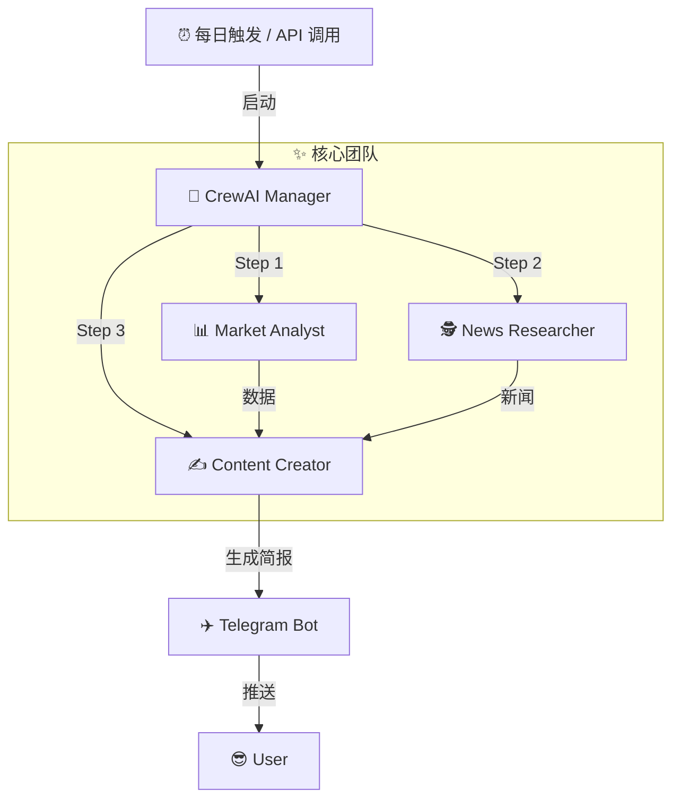

# 🚀 Connect-to-QQQ100-Index-agent
> **你的私人纳斯达克指数 AI 分析师 (｡•̀ᴗ-)✧**


## 🌟 项目简介 (What is this?)

嗨！欢迎来到 **QQQ100-Index-Agent**。这是一个通过 AI 自动化工作的智能代理项目。
你是否厌倦了每天收盘后还要手动翻看 K 线和新闻？(￣▽￣)"

这个 Agent 的目标是解放你的双手：
1.  **自动盯盘**：捕捉 QQQ（纳指100）当天的涨跌幅。
2.  **智能搜寻**：分析为什么涨？为什么跌？（是鲍威尔又讲话了？还是英伟达起飞了？）
3.  **贴心汇报**：最后把一切汇总成一份简短的研报，推送到你的 Telegram。

---

## 🛠️ 工作流 (How it works?)

我们的 AI 团队由三位顶尖专家（Agents）组成，他们协同工作，为你服务：



### 🤖 认识一下团队成员

| 角色 | 职责 | 技能点 |
| :--- | :--- | :--- |
| **📊 Market Analyst** | 负责算数，提取 QQQ 开盘/收盘/成交量 | `Mathematics`, `Data Extraction` (⌐■_■) |
| **🕵️ News Researcher** | 负责八卦（划掉），负责宏观资讯搜集 | `Search`, `Summarization` 🧐 |
| **✍️ Content Creator** | 负责文笔，把枯燥的数据变成人话 | `Copywriting`, `Storytelling` 📝 |

---

## 🛠️ 技术栈 (Tech Stack)

本项目使用以下核心库构建：

- **[CrewAI](https://github.com/joaomdmoura/crewai)**: `^1.7.0` - 多 Agent 协同框架
- **[LangChain](https://github.com/langchain-ai/langchain)**: `^0.4.1` - 大模型应用开发框架
- **[FastAPI](https://fastapi.tiangolo.com/)**: `^0.124.4` - 提供 RESTful API 接口
- **[Uvicorn](https://www.uvicorn.org/)**: `^0.30.0` - 高性能 ASGI 服务器
- **[yfinance](https://github.com/ranaroussi/yfinance)**: `^0.2.66` - 雅虎财经数据获取
- **[Ruff](https://docs.astral.sh/ruff/)**: `^0.14.9` (Dev) - 极速 Python 代码 Linting 和 Formatting 工具

> 💡 **Windows 用户注意**：本项目已内置 Windows 信号兼容性修复，解决了 CrewAI 在 Windows 上运行时的 `AttributeError: module 'signal' has no attribute 'SIGHUP'` 问题。

---

## ⚡ 快速开始 (Quick Start)

我们要使用最酷的 **uv** 包管理器来运行这个项目！速度飞快！🚀

### 1. 克隆项目
```bash
git clone https://github.com/CaiusLuo/Connect-to-QQQ100-index-agent.git
cd Connect-to-QQQ100-index-agent
```

### 2. 安装依赖 (使用 uv)
不需要漫长的等待，`uv` 会搞定一切环境问题：
```bash
# 这一步会自动创建 .venv 并安装 pyproject.toml 中的依赖
uv sync
```

### 3. 配置你的秘密武器 (.env)
复制环境变量模板，填入你的 **OpenAI Key**（必填）和 **Telegram Token**：
```bash
cp .env.example .env
# 记得编辑 .env 文件！
# OPENAI_API_KEY=sk-...
```

### 4. 启动服务器
本项目现在作为一个 API 服务器运行：
```bash
uv run main.py
```
启动成功后，你会看到：
```
🚀 启动 FastAPI 服务器...
📡 访问地址: http://localhost:8000
📋 API 文档: http://localhost:8000/docs
```

---

## 📡 API 使用指南

服务器启动后，你可以通过以下方式与 Agent 交互：

### 1. 查看 API 文档
访问 [http://localhost:8000/docs](http://localhost:8000/docs) 查看完整的 Swagger UI 文档。

### 2. 触发分析任务 (Invoke)
发送一个 **POST** 请求到 `/invoke` 端点来启动分析流程。

**使用 curl:**
```bash
curl -X POST http://localhost:8000/invoke
```

**使用 Python:**
```python
import requests

response = requests.post("http://localhost:8000/invoke")
print(response.json())
```

---

## 📂 项目结构

```
.
├── config/               # 🧠 大脑配置区
│   ├── agent.yaml        # 定义 Agent 的人设和背景
│   └── task.yaml         # 定义具体的任务步骤
├── src/                  # ⚙️ 核心代码区
│   ├── tools/            # 🛠️ 武器库 (finance_tool 已实现)
│   ├── utils/            # 🧰 杂项 (Telegram notifier)
│   └── crew.py           # 🎬 导演脚本 (Crew 编排)
├── main.py               # 🚪 启动入口 (FastAPI Server)
├── pyproject.toml        # 📦 依赖管理
└── README.md             # 📖 你正在看的这本书
```

---

## 📅 开发计划 (Roadmap)

- [x] **Phase 1**: 项目初始化 &环境搭建 (uv) ✅
- [x] **Phase 2**: 定义 Agent 和 Task (YAML 配置) ✅
- [x] **Phase 3**: 实现 `finance_tool` (yfinance 对接 & BaseTool 适配) ✅
- [x] **Phase 4**: 集成 FastAPI 构建 API 服务 ✅
- [ ] **Phase 5**: 实现 News Researcher Agent 和搜索工具 🚧
- [ ] **Phase 6**: 对接 Telegram Bot API 🚧
- [ ] **Phase 7**: 躺平赚钱 (Dreaming...) 🛌

---

## 🤝 贡献 (Contributing)

发现 Bug 了？想增加新功能（比如加入 Crypto 市场）？
欢迎提 **Pull Request** 或者 **Issue**！

<p align="center">
  Made with ❤️ and plenty of ☕ by <a href="https://github.com/CaiusLuo">CaiusLuo</a>
</p>
